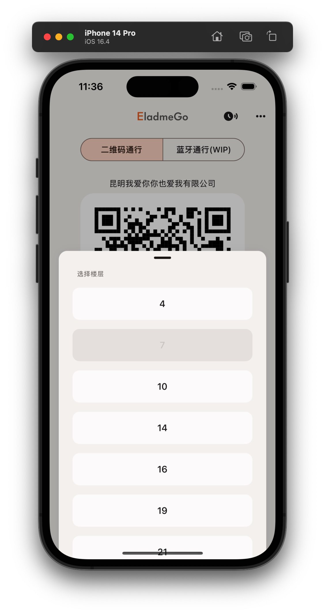
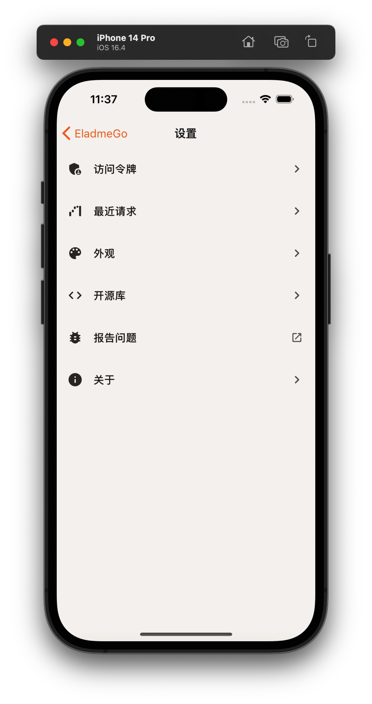

# EladmeGo

[](https://github.com/shensven/EladmeGo/actions/workflows/test.yml)
[](https://github.com/shensven/EladmeGo/actions/workflows/publish.yml)

本项目是昆明金地中心访问通行的移动端轮子

|                        1                        |                          2                           |                            3                            |                          4                          |
| :---------------------------------------------: | :--------------------------------------------------: | :-----------------------------------------------------: | :-------------------------------------------------: |
|  |  |  |  |

## 📦 分发

### iOS

- [TestFlight](https://testflight.apple.com/join/54UVmWJQ)

### Android

- [GitHub Releases](https://github.com/shensven/EladmeGo/releases)

## 🔨 编译

### 先决条件

- [Node 14](https://nodejs.org) 或更高版本
- [yarn](https://yarnpkg.com/getting-started/install) 包管理器
- [Watchman](https://formulae.brew.sh/formula/watchman)
- [Xcode 10](https://developer.apple.com/xcode/resources)或更高版本
- [CocoaPods](https://guides.cocoapods.org/using/getting-started.html)
- [JDK 11](https://formulae.brew.sh/formula/openjdk@11) 或更高版本
- Android SDK
  - Build-Tools `33.0.0`
  - NDK `23.1.7779620`

### 起步

```sh
yarn install
cd ios && pod install
```

### iOS 真机部署

```sh
yarn ios --configuration Release --device
```

### 打包 Android apk

```sh
cd android && chmod +x gradlew
./gradlew assembleRelease
```

## 生成启动图

```sh
yarn react-native generate-bootsplash src/assets/splash/bootsplash.png \
  --background-color=F2E8E2 \
  --logo-width=288 \
  --flavor=main
```
